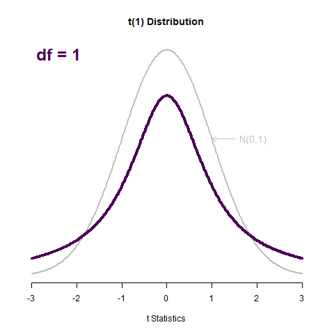

  
```{r setup, include=FALSE}
knitr::opts_chunk$set(echo = TRUE)
source("plot_t.R")
```

# Learning Objectives

## Statistical Learning Objectives
1. Learn about the $t$ distribution
1. Get experience making confidence intervals for population means
1. Understand hypothesis tests for population means

## R Learning Objectives
1. Interpret R output providing confidence intervals and hypothesis tests for inference on population means.

## Functions covered in this lab
1. `pt()`
1. `qt()`
1. `plot_t()` (custom)
1. `t.test()`

## Weekly Advice
The function `t.test()` will compute the results from both a hypothesis test and a confidence interval. You should pay close attention to the alternative hypothesis. If you are running a hypothesis test, be sure that the correct direction (`greater`, `less`, `two.sided`) is specified in `t.test()`, otherwise your p-value will be inaccurate. If you are running a confidence interval, be sure that the direction is set to `two.sided`, which can be achieved by leaving the alternative hypothesis as the default. You can double-check your thinking by reading the output - the alternative hypothesis is printed in the 4th line of output.
  
# Lab Tutorial

This week, we're talking about inference for population **means**. We generally talk about means for *continuous* data: we're shifting our focus from categorical data (proportions). This is a new tool in our statistical toolkit that will let us answer different questions about data. Keep in mind that the parameter we're interested in now is **$\mu$** (mu). 

## The $t$ distribution

The **$t$ distribution**, like the normal distribution that we've seen before, is bell-shaped. The t distribution, however, has "heavier tails" than the normal distribution. This is so that we can capture the increased uncertainty introduced by not knowing $\sigma$, the population standard deviation.

The $t$ distribution is a "family" of distributions, meaning there are an infinity of them. The same is true of the normal distribution -- there are infinite different normal distributions. We describe which normal distribution we're talking about with the mean and standard deviation. For $t$ distributions, we identify which one we're talking about using **degrees of freedom (df)**. As the degrees of freedom increase, the $t$ distribution gets closer and closer to a standard normal distribution, N(0, 1). Check this out:



The $t$ distribution is used to help us understand the sampling distribution of sample means $\bar{x}$. The $t$ distribution describes "$t$ statistics", which are related to $\bar{x}$ in this way:
$$t = \frac{\bar{x}- \mu}{s/\sqrt{n}}$$
where $s$ is the sample standard deviation, $\mu$ is the population mean, and $n$ is the size of the sample that generated the sample mean $\bar{x}$. 

We can find probabilities related to the t distribution using the `pt()` function (sounds similar to `pnorm()`, huh? That's on purpose!). Just like `pnorm()`, `pt()` will give you the area under the curve to the *left* of the value you provide. Unlike `pnorm()`, `pt()` requires you to specify the degrees of freedom, using the `df` argument.

We can also use `plot_t()` just like `plot_norm()`, except with the `df` argument.

```{r pt1}
pt(q = 1.4, df = 4)
plot_t(df = 4, shadeValues = 1.4, direction = "less")
# Just like with  the options for direction are "less", "greater", "between", and "beyond"
```

Also, we can use `qt()` to get percentiles of the t distribution, just like with `qnorm()`:

```{r qt1}
qt(p = .8829, df = 4)
```

## Conditions for Inference on One Population Mean

In order to use our machinery for constructing confidence intervals and performing hypothesis tests for means, we need two conditions to hold. **What are they?**

1. *Condition 1*
2. *Condition 2*

Let's say hi to our penguin friends -- we haven't seen them in a while!

```{r penguins}
penguins <- read.csv("penguins.csv", stringsAsFactors = TRUE)
str(penguins)
```

Let's say we want to construct a confidence interval for the population mean flipper length of penguins living in the Palmer Archipelago, or conduct a hypothesis test for that mean. 
The first thing we need to do is make sure that it makes sense to do this!

In order to use our machinery for constructing confidence intervals and performing hypothesis tests for means, we need two conditions to hold. **What are they?**

1. *Condition 1*
2. *Condition 2*

Let's check these conditions!

1. We don't know exactly the sampling mechanism used in this data, but we'll proceed with caution. (Check out the article the data were collected for if you're interested in more details:  https://doi-org.proxy.lib.umich.edu/10.1371/journal.pone.0090081)

2. To check the nearly-normal condition, we need to look at the data! One way to do this is to look at a histogram. Another is to examine a **Q-Q plot**.

### Checking the Normality Condition

Let's start by making a histogram 

```{r flipperHist}
hist(penguins$flipper_length_mm,
     main = "Histogram of Flipper Length",
     xlab = "Flipper length (mm)",
     col = "peachpuff")
```

*Replace this text with your thoughts about this histogram. Is the condition satisfied?*


**BUT:** We've got a big sample size (333). What this tells us is that the nearly-normal assumption is not nearly as important as it would be if we didn't have that sample size. _Because we have a large sample size, we can say that the distribution of sample **means** will be nearly normal by the central limit theorem, which is what we actually need to proceed._


## The `t.test()` function

Let's construct a 90% confidence interval for the population mean flipper length of penguins living in the Palmer Archipelago. 

The first thing we should do here is to just look at some summary statistics: what does this data look like?

```{r}
summary(penguins$flipper_length_mm)
```

So the mean flipper length of the penguins in our sample is 201 mm. That will be the center of our confidence interval: remember that a confidence interval looks like $$\text{estimate} \pm \text{(a few)} \times \mathrm{SE}_{\text{estimate}}.$$

We can easily do this using the `t.test()` function. This is similar to `prop_test()`! Woo! All we do is give `t.test()` the variable we want to examine and a `conf.level`.

```{r t.test1}
t.test(penguins$flipper_length_mm, conf.level = 0.9)
```

So we estimate with 90% confidence that the population mean flipper length for all penguins in the Palmer Archipelago is between 199.7mm and 202.2mm.

Take a look at that p-value now: it's very, very, very small. But let's look at what hypotheses this is testing. Notice the line that says "`alternative hypothesis: true mean is not equal to 0`". That's telling you R ran a test of 
$$H_0: \mu = 0 \quad \text{vs.} \quad H_a: \mu \neq 0.$$

Does our sample provide any evidence that $\mu = 0$? NO. So our p-value is basically zero! We have extremely strong evidence to say that $\mu \neq 0$. This also makes sense because if the population mean flipper length was zero, would penguins still have flippers? They definitely have flippers. Let's pick a more realistic set of hypotheses. 

Let's test 
$$H_0: \mu = 199 \quad \text{vs.} \quad H_a: \mu > 199.$$
Let's take a moment to remind ourselves how a $t$-statistic is formed. The $t$-statistic is 
$$ t = \frac{\bar{x} - \mu_0}{s / \sqrt{n}}, $$
where $s$ is the **sample** standard deviation (remember we use $s$ because we don't know $\sigma$, the population standard deviation), and $n$ is the sample size. $\mu_0$ is the null hypothesis value of the population mean. We can get the sample standard deviation in R using the `sd()` function:

```{r sd}
sd(penguins$flipper_length_mm)
```

We can have R carry out this hypothesis test for us. To do this, we'll provide the `mu` and `alternative` arguments to `t.test()`:

```{r t.test2}
t.test(penguins$flipper_length_mm, mu = 199, alternative = "greater")
```

`mu` specifies the null-hypothesis value to use in the test (think of `mu` as setting $\mu_0$).

Notice that this p-value is much more reasonable and the test statistic (`t`) isn't nearly as large. So our data provide pretty strong evidence that the population mean flipper length is greater than 199 mm. 

**Note:** You'll be interpreting the results of the confidence interval and the hypothesis test in the same manner as in Lab 8. All that has changed from last week to this week is the *parameter* of interest: this week our parameter of interest is a population **mean**. Recall that in order to find a mean, we would need to collect **quantitative** data.

**Another note:** It's pretty clear from our knowledge of this data and the bimodal distribution of flipper length that penguin species is probably meaningful here. We ignored this in the demo; in real life, we should not. Bimodal distributions tend to suggest that there's an important subgroup effect happening: we should really investigate this rather than just forge ahead like we did. We'll look into this more deeply next week!

## Code Cheat Sheet

The formatting of this will be easier to read in the knitted version of the document.

- **`pt(q, df, lower.tail = TRUE)`**
  - `q` is the x-axis value you want to find an area related to
  - `df` is the degrees of freedom of the $t$ distribution
  - `lower.tail` determines whether `pt()` finds the area to the left or right of `q`. If `lower.tail = TRUE` (the default), it shades to the left. If `lower.tail = FALSE`, it shades to the right.
- **`qt(q, df, lower.tail = TRUE)`**
  - `p` is the probability or area under the curve you want to find an x-axis value for
  - `df` is the degrees of freedom of the $t$ distribution
  - `lower.tail` determines whether `pt()` finds the area to the left or right of `q`. If `lower.tail = TRUE` (the default), it shades to the left. If `lower.tail = FALSE`, it shades to the right.
- **`plot_t()`**
  - `df` refers to the degrees of freedom of the distribution to plot. You must provide this value.
  - `shadeValues` is a vector of up to 2 numbers that define the region you want to shade
  - `direction` can be one of `less`, `greater`, `beyond`, or `between`, and controls the direction of shading between `shadeValues`. Must be `less` or `greater` if `shadeValues` has only one element; `beyond` or `between` if two
  - `col.shade` controls the color of the shaded region, defaults to `"cornflowerblue"`
  - `...` lets you specify other graphical parameters to control the appearance of the normal curve (e.g., `lwd`, `lty`, `col`, etc.)
- **`qqnorm(y, ...)`**
  - `y` refers to the variable for which you want to create a Q-Q plot
  - `...` lets you control graphical elements of the plot like `pch`, `col`, etc.
- **`qqline(y, ...)`**
  - `y` refers to the variable for which you created a Q-Q plot
  - `...` lets you control graphical elements of the plot like `pch`, `col`, etc.
  - Function can only be used *after* using `qqnorm()`
- **`t.test(x, alternative = c("two.sided", "less", "greater"), mu = 0, conf.level = 0.95)`**
  - `x` is a vector of data values
  - `alternative` specifies the direction of the alternative hypothesis; must be one of "two.sided", "less", or "greater"
  - `mu` indicates the true value of the mean (under the null hypothesis); defaults to 0
  - `conf.level` is the confidence level to be used in constructing a confidence interval; must be between 0 and 1, defaults to 0.95

